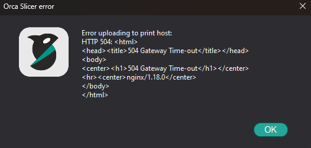


# Peopoly Magneto X Frequently Asked Questions

###### Last Updated: 12/23/24

# Notes
- All answers pertain to printer shipping version of 10/1/24 and firmware v1.1.4 or later unless otherwise specified.
- Where authors are provided it only reflects who wrote the FAQ as all answers have many community contributions, with references provided when possible.
- All outbound links, such as to Amazon, are unaffiliated. 

Please send any questions, comments, suggestion, new FAQs to `@kaihanga` on Discord or via [kaihanga@nulleta.com](mailto:kaihanga@nulleta.com).

An [Official FAQ](https://wiki.peopoly.net/en/magneto/magneto-x/magneto-x-faq) is also available.

Read your manual, confirm what you're doing, everything's at your own risk.

# General
- [What's the size, measurements, etc.?](#whats-the-size-measurements-etc)
- [Setup Guides are wrong or don't make sense?](#setup-guides-are-wrong-or-dont-make-sense)

# Printer
- [How to install a Beacon?](#how-to-install-a-beacon)
- [How to SSH into the printer?](#how-to-ssh-into-the-printer)
- [What and how to lubricate?](#what-and-how-to-lubricate)
- [How to install the Nozzle Wiper?](#how-to-install-the-nozzle-wiper)
- [How to lower the print bed after a print?](#how-to-lower-the-print-bed-after-a-print)
- [Received a timeout in Orcaslicer when sending a print?](#received-a-timeout-in-orcaslicer-when-sending-a-print)
- [How to fix Pause and Resume](#how-to-fix-pause-and-resume)

# Enclosure
- [Enclosure installation tips](#enclosure-installation-tips)
- [How to install Display at top?](#how-to-install-display-at-top)

# Support & Community
- [Is there a community to share and learn about other's experience?](#is-there-a-community-to-share-and-learn-about-others-experiences)

# Filament Profiles
- [PET-CF Profile](#pet-cf-profile)

# Other Section Ideas

### Printing (common VFA, Ringing suggestions, etc.)

# Answers... ish
<a name="whats-the-size-measurements-etc"></a>
## What's the size, measurements, etc.?

###### Author(s): @kaihanga

**Bed**: 400mm x 300mm x 300mm

**Printer**: 60.5cm x 54cm x 70cm (length, width, height)
- Add 26cm on left side (printer facing you) for filament spool & power cable
- Measurements includes feet and slack height for the filament feed line
- Front display adds 6.5cm to height and 4cm to width

**Enclosure**: Total of 79cm with 25cm for front door(s) access
- Same additions for the display, if mounted on top, otherwise for regular position just add for width

**Jetstream Side Cooling**: Increases printer length to 68cm (adds 7.5cm)

<a name="setup-guides-are-wrong-or-dont-make-sense"></a>
## Setup Guides are wrong or don't make sense?

###### Author(s): @kaihanga

The Setup Guides, such as for the [Printer](https://wiki.peopoly.net/en/magneto/magneto-x/setup-guide), [JetStream](https://wiki.peopoly.net/en/magneto/magneto-x/install-jetstream), and [Enclosure](https://wiki.peopoly.net/en/magneto/magneto-x/enclosure-setup-guide-q) don't match what you recevied or they're wrong or they don't make sense.

The setup guides represent the state of the printer back when it was first introduced and - for the most part - haven't been updated since, including to accomodate all the improvements.

Here are various notes for each, please message the author with any others inconsistencies.

### Printer
- The parts kit is under the bed rather than over it
- Wifi antennas a traditional rather than flat style
- Parts kit doesn't include a PTFE tube, rather it's coiled around the toolhead
- Various pictures throughout

### JetStream
- Installs on right side rather than left as that's where the four needed screw holes are
- Power & control connection is also under the bottom right panel rather than left side and is unlabeled

<a name="how-to-install-a-beacon"></a>
## How to install a Beacon

###### Author(s): @kaihanga

**WARNING - In progress, proceed with caution**

What's a [Beacon](https://beacon3d.com/)?

Notes:
- Order Beacon Normal, not low-profile, and 10' cable
- You'll need to be comfortable with SSH access and Klipper UI navigation

1. Print mount, I used [this mod](https://discord.com/channels/1158578009121501267/1286448210868437023) in ASA-CF
	1. It's going to be near bedheat so heat deflection, etc. is good
	2. Included PETG-CF isn't enough, reports of sagging
	3. Must be stable
2. Using linked mount
   1. unscrew 4 screws near nozzle
   2. Slightly move nozzle cable out of way and return when done, 2 are clockwise while two are counter-clockwise
   3. Attache Beacon with pointed side facing the nozzle 
   4. Hand-tighten
3. Attach cable connection to beacon, tab facing nozzle
4. Unscrew bottom right side base cover, 10 screws
5. Attach USB cable to any USB port
   1. Be sure there's plenty of slack and the cable's not interferring with the toolhead  
6. Power on printer
7. [Follow Beacon Quickstart](https://docs.beacon3d.com/quickstart/)
	1. Including Moonraker configuration
	2. `ls /dev/serial/by-id`
	3. See sample `printer.cfg`
	4. TODO measure Beacon offset direction 
	5. TODO Not doing safe section
	6. Calibrate, via commands in Klipper UI
		1. Home `g28 x y`
		2. Center `G0 X150 Y200`
		3. With paper under nozzle, manually move Z until drags
			1. Beacon RED LED will light
		4. `BEACON_CALIBRATE`
			1. Move up & down -.001
			2. ACCEPT
		5. `BEACON_AUTO_CALIBRATE`
			1. Be sure not to have drag on USB line, will disrupt measure
	7. TODO Finish and do a print
8. Tidy up cabling
	1. Cable can be routed in the cable chain but needs to have distance from the motor wiring due to noise [Source](https://discord.com/channels/641407187004030997/1046570329184669817/1317043210819731487)
9. Reattach bottom right panel

**Config examples**
<a name="how-to-ssh-into-the-printer"></a>
## How to SSH into the printer?
SSH access is needed for a number of low-level tasks such as installing addons.

Open a terminal and `ssh pi@<your Magneto X IP address>`

The default username is "pi" and the password is "armbian".

##### References

[Guides to modify the timezone](https://wiki.peopoly.net/en/magneto/magneto-x/mainsail-os-timezone-setting)

<a name="what-and-how-to-lubricate"></a>
## What and how to lubricate?

###### Author(s): @kaihanga

Peopoly's [Linear Guide Maintenance](https://wiki.peopoly.net/en/magneto/magneto-x/linear-guide-maintenance).

Lubricate every 4 - 6 weeks is necessary with some evidence it helps with VFAs, Ringing, etc. 

Use an NLGI 2 grease such as [Mobil Polyrex EP2](https://www.amazon.com/Mobilux-Grease-NLGI-13-7-oz/dp/B01N191WZE)
- [NLGI](https://en.wikipedia.org/wiki/NLGI_consistency_number) refers to the consistency, in this case like peanut butter.

Recommended [syringes](https://www.amazon.com/Wisdom-Syringe-Irrigation-Syringes-Measure/dp/B09X9L5GVN), for getting into tighter places, such as the X carraige.

##### References
- ["I'm using Mobilux EP2 based on recommendations and what some folks selling linear rails were selling"](https://discord.com/channels/1158578009121501267/1246637611674636379/1282144149436502077)

General maintenance tips: [Lubrication Basics - Keep your 3D printer running smooth and quiet](https://www.youtube.com/watch?v=UYvhYjkBFTY).

1. Ensure printer is powered off
2. Inspect the rails, if rust found, remove with WD-40
3. Using a gloved hand, smooth it onto both side of all the rails:
   1. 2 on top for the Y axis
   2. 1 under the gantry for the X axis
   3. All 4 vertical Z axis
4. Manually move the toolhead back and forth in both X & Y axes to ensure even distribution of the grease along the entire rail.
5. Clean up any excees on the toolhead

##### References
["If the grease isn't oozing out and making a mess then you're not using enough."](https://discord.com/channels/1158578009121501267/1246637611674636379/1282151638865547264)

<a name="how-to-install-the-nozzle-wiper"></a>
## How to install the Nozzle Wiper

###### Author(s): @kaihanga

The [nozzle wiper installation docs](https://wiki.peopoly.net/en/magneto/magneto-x/nozzle-wiper) suggest placing the felt before moving the toolhead to align. Unfortunately, the toolhead cannot move as far X as suggested due to the part cooling fan. This may be due to the docs being written before the present fan design.

1. Follow the installation
   1. EXCEPT do the toolhead move first then place the felt
   2. Note the two x & y coordinate sets
2. In the macros.cfg file
   1. Copy & Paste the GCODE into the macros.cfg file
   2. Replace the two x, y coordinates as the installation directs
   3. Add the `MAG_WIPE_NOZZLE` macro near the bottom of the `PRINT_START` macro, before `LINE_PURGE`

<a name="how-to-lower-the-print-bed-after-a-print"></a>
## How to lower the print bed after a print?

###### Author(s): @kaihanga

Replace the `PRINT_END` macro in `macros.cfg` with the following...
```
[gcode_macro PRINT_END]
variable_max_z: 300  # Set this to your printer's max Z height
gcode:
  G91                              # Switch to relative positioning
  G1 Z5 F600                       # Raise the nozzle by 5mm (lower bed by 5mm)
  G1 E-5 F300                      # Retract filament
  G90                              # Switch back to absolute positioning
  G1 X150 Y10 F12000               # Move nozzle to park position
  M104 S0                          # Turn off hotend
  M140 S0                          # Turn off bed heater
  M106 S0                          # Turn off part cooling fan
  
  G1 Z{target_z} F600              # Move bed to halfway point between current Z and max Z
  UPDATE_DELAYED_GCODE ID=delay_disable_motor DURATION=30  # Delay motor disable
```
##### References
["This is tested to and works on my V0.  I changed the values here to match the Magneto:"](https://discord.com/channels/1158578009121501267/1246637611674636379/1318281835536580703)

<a name="received-a-timeout-in-orcaslicer-when-sending-a-print"></a>
## Received a timeout in Orcaslicer when sending a print?

You received the following timeout error when sending a print, which may have still started. 


The Magneto X is closing the Orcaslicer connection before fully processing and accepting the print request.

To fix, a network component of the Magneto X needs to be adjusted to allow the printer to take longer to process the print request. The catch is that this isn't a one-size-fix-all solutoon as the timeout period may need to be further adjusted for larger and larger print sizes. It also can't be made excessively big, or even infinite, as that creates other issues. The suggestion is to start with the recommendation below, increasing to as much as 1600s as needed.

This improvement requires SSH access.

1. SSH into the printer
2. Edit nginx's settings, add the following 4 lines to the bottom of the ``http`` section of /etc/nginx/nginx.conf, such as ``sudo nano /etc/nginx/nginx.conf``
   1. proxy_send_timeout 500s;
   2. proxy_read_timeout 500s;
   3. fastcgi_send_timeout 500s;
   4. fastcgi_read_timeout 500s;
3. Restart nginx, ``sudo systemctl restart nginx``
4. Confirm nginx is running, ``sudo systemctl status nginx``
   1. Should see ``active (running)`` in the middle

##### References
["If the plate upload size is too big I get that error. It looks like you can change some config settings..."](https://discord.com/channels/1158578009121501267/1167525280756277268/1307806171637354616)

["It's not an issue with orcaslicer, but with nginx on the printer."](https://github.com/SoftFever/OrcaSlicer/issues/857#issuecomment-1569493181)

<a name="how-to-fix-pause-and-resume"></a>
## How to fix Pause and Resume

###### Author(s): @kaihanga

The Pause & Resume funtionality's broken due to there being multiple defitions of the ```[gcode_macro PAUSE]``` and ```[gcode_macro RESUME]``` macros across the ```macros.cfg``` and ```mainsail.cfg``` files. The ones in ```mainsale.cfg``` need to be commented out as those in ```macros.cfg``` are correct.

This file cannot be edited by the Klipper web interface as it's read-only.

1. SSH into the printer
2. ```nano mainsail-config/mainsail.cfg```
3. Comment out, that is put a ```#``` in front of every line, of the ```[gcode_macro PAUSE]``` and ```[gcode_macro RESUME]``` macros. That is every line from those macros through to the next ```[gcode_macro ...]``` line.
4. Exit and save the file 

##### References
["Wow. Downloaded mailsail, commented out the pause and resume and then uploaded it ..."](https://discord.com/channels/1158578009121501267/1293894304711970878/1320213727114563646)

<a name="enclosure-installation-tips"></a>
## Enclosure installation tips

###### Author(s): @kaihanga

- Bring your own allen key set
  - You'll be installing many screws and the keys included witrh the printer aren't fun to use for extended periods
  - Something like the [SHOWPIN Electronics Precision Screwdriver Set](https://www.amazon.com/gp/product/B0CQC488VR) or the [iFixit Pro Tech Toolkit](https://www.amazon.com/gp/product/B01GF0KV6G)
- Try to position panels with the text describing the part number facing inward, at the bottom
  - It's not always possible
- Peel back the scratch protection to only what's needed to access the screw holes until you're done
- Start printing the reinforcements
  - Suggest heat deflective filament, as it's inside. The PETG-CF that comes with the printer should be fine.

<a name="how-to-install-display-at-top"></a>
## How to install Display at top?

###### Author(s): @kaihanga

The cables two cables needed for the display don't easily reach the top.

1. Extend cables at bottom
2. Buy [Micro HDMI](https://www.amazon.com/Cablecc-Micro-Female-Extension-Cable/dp/B00S6B8TCQ) and [USB Type-A](https://www.amazon.com/C2G-52119-USB-Extension-Cable/dp/B00CJG2ZYM) Extenders
	1. Yes, it's Mini HDMI and USB Type C at the console but it's micro HDMI and USB Type-A connecting to the Orange PI computer
3. Remove bottom right panel
4. Clip zip ties binding cables
5. Unscrew Z motor; it can be torqued in tough
6. What's first and second here may differ for you
	1. Use needle-nose pliers to remove glue
	2. Pull out cables
	3. Rinse, repeat as necessary
	4. Keep enough cable slack to connect to extenders
7. Carefully pull each cable from top feeding additional cable from the bottom - Don't stress the cables!
8. Check for good slack and the three points: top out for the screen, middle in to take the cables down the rail, and space around the z motor
9. Hook up extensions and mount screen, confirming you have the needed cable length 
10. Reattach Z motor
11. Turn on and test screen works
12. Clean up
	1. Optional - Zip tie cables
	2. Reattach bottom right panel

<a name ="is-there-a-community-to-share-and-learn-about-others-experiences"></a>
## Is there a community to share and learn about other's experience?

There's an "official" discord with an active community. [Click here for an invitation](https://discord.gg/rVUKaBAGKC).

[Information from Peopoly about the community](https://peopoly.net/blogs/news/join-peopoly-discord-community)

<a name="pet-cf-profile"></a>
## PET-CF Profile

###### Author(s): @kaihanga
- Nozzle temp: 300
- Build plate temp: 75
- Max volumetric: 30
- Flow ratio: 0.9
- Pressure advance: 0.022
- Gluestick: Required

##### References
["Thanks for a reminder. My max volumetric is 30, flow ratio is .9, PA is 0.022..."](https://discord.com/channels/1158578009121501267/1167525094839562321/1319017426603479060)


